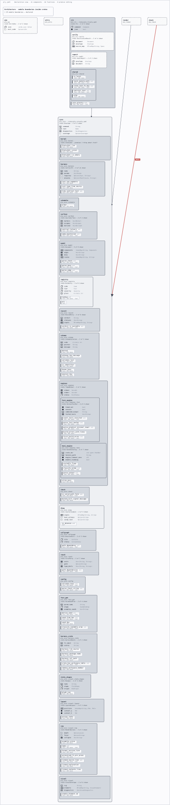

# Ply's own architecture

This document describes how Ply is put together, and it is not a hand-drawn picture of
what someone remembers being true. The diagram below is rendered from
[`ply.yaml`](ply.yaml) — the same file `cargo ply check` reads when Ply is pointed at its
own repository — so the shape you are looking at is the shape the checker enforces. If
someone adds a dependency this page does not show, the build says so.

<p align="center">
  
</p>

Each box is a crate. The boxes are **dashed** because none of them declares a function
contract yet: Ply's own `ply.yaml` says only how the crates may depend on one another, and
a dashed box is Ply's way of showing code that carries no claims of its own. The arrows are
the only dependencies permitted between components. Anything else is a violation.

## The four crates

| Component | Crate | What it is |
|---|---|---|
| `attrs` | `ply-attrs` | The `#[ply::requires]` / `#[ply::ensures]` attribute macros. A proc-macro crate: it is compiled for the machine doing the building, not the machine the program will run on. |
| `core` | `ply-core` | The model, the schema, the call graph, the engine adapters (Kani, proptest, cargo-mutants), the result records, and the verdict kernel. Everything Ply knows how to do, with no terminal attached. |
| `cli` | `ply-cli` | The `cargo ply` commands — `check`, `verify`, `audit`, `worklist` — and every sentence a user reads. |
| `e2e` | `ply-e2e` | The end-to-end suite. It builds the real binary and drives it the way a user would. |

## The rules, and why each one exists

**`attrs` stands alone.** It is a proc-macro crate, compiled for the host rather than the
target. A dependency from it into the library would compile perfectly well and would be
wrong: the macro would begin depending on the very thing it exists to annotate.

**`core` never reaches up into `cli`.** Everything `core` does has to be usable without a
terminal. That constraint is what makes the engine adapters testable at all — the moment a
diagnostic's wording lives in `core`, the wording and the engine can only be tested
together.

**`cli` is the top of the stack.** It is the only component allowed to depend on `core`,
and nothing may depend on `cli`. This is what makes the direction of the whole graph
unambiguous.

**`e2e` drives the built binary, not the library.** A suite that links the library instead
stops testing what ships.

## The exception, declared rather than hidden

That last rule is the interesting one, because Ply caught this codebase breaking it.

`e2e` originally had no outgoing edge at all. Running `cargo ply check` on this repository
while writing this document reported that `ply_e2e` had grown a dependency on `ply_core`
and that nothing in the spec allowed it:

```
A0401 crate `ply_e2e` depends on crate `ply_core`. `ply_e2e` belongs to the `e2e`
  component and `ply_core` belongs to `core`, and no `->` edge in this document says
  `e2e` may depend on `core` — so this dependency crosses a boundary nothing allows.
  Add "e2e -> core" under `edges:` if this is intended, or remove the dependency.
```

The dependency turned out to be real and wanted. One measurement test reads `core`'s own
type classifier directly, so the published count of which Rust types Ply can handle can
never drift into a second, hand-maintained idea of the same fact. The right answer was to
declare the exception, which is now the second arrow on the diagram.

It is worth being precise about what that costs, because the arrow is wider than the
exception deserves. Ply's architecture checking works at the level of crates today, so the
strongest thing the spec can say is "`e2e` may depend on `core`" — not "one test file
may". Narrowing it to the single file is a fact about calls inside functions, and that
tier is not built. Until it is, this edge rests on a convention no tool enforces:
everything in `e2e` except that one measurement must keep driving the binary.

That is the whole point of writing it down here. A rule that quietly stops being true is
worse than a rule with a stated exception.

## Checking it yourself

From the repository root:

```console
$ cargo ply check .
cargo ply check — ./ply.yaml

  schema        The document against schema/ply.schema.json, then every rule that can be
                settled from the document alone.
  anchors       This document declares no fn claims, so there was nothing for this tier to
                resolve.
  architecture  2 real crate dependencies cross between two differently-declared components:
                2 permitted by a declared edge or by nesting, 0 not permitted (reported
                below). 4 of 4 crates in this workspace belong to a declared component.

  No problems found in the document.

What this command did NOT check:
  item-level    NOT CHECKED. Ply now checks whether one crate depends on another crate
                across a boundary no `edges:` line allows. It does not yet look inside your
                functions: a call from one function to another, use of a capability like the
                filesystem or the network, or a change to a type another component owns can
                still cross that same boundary with nothing here noticing.
```

Two things in that output are deliberate. The dependency count is reported whether or not
anything was wrong, so a clean run is a count you can check rather than a silence you have
to trust. And the run states what it did **not** look at, so "no problems found" cannot be
mistaken for "this architecture is fully enforced" — the checking that happens inside
functions does not exist yet, and the tool says so itself rather than letting you assume
otherwise.

## Regenerating the diagram

The SVG is committed, and a test fails if it stops matching the spec it was rendered from:

```console
$ cargo run --release -p ply-render -- ply.yaml -o docs/ply-self.svg   # from tools/
```

## Where the rest is written down

- [The-Ply-Spec.md](The-Ply-Spec.md) — the source of truth for the grammar, the evidence
  ladder, and every decision behind them.
- [README.md](README.md) — what Ply is for and what it can do today.
- [TODO.md](TODO.md) — what is agreed, what has landed, and which gaps are open on purpose.
