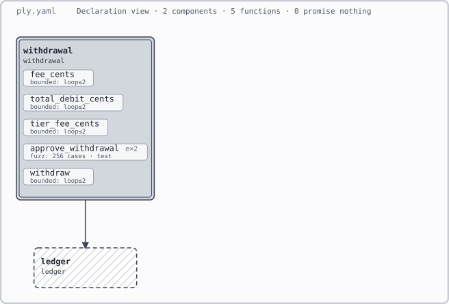

# Ply

Ply is a specification, verification, and visual-development layer for plain Rust.
It aims to bridge the gap between blind "trust me bro!" agent 'vibe' coding and reviewing every
generated line by hand.

A developer states what the program must do. An agent writes the implementation. Ply
routes those claims to existing checking tools, records the evidence they earn, and
reports concrete counterexamples when a claim fails. The developer reviews the intent,
the boundaries, and the uncovered risk instead of treating plausible code as proof.

> **Project status: active early-alpha development.** The CLI, schema, checking pipeline,
> result records, and static SVG renderer exist. Rust coverage remains narrow, and
> adversarial testing continues to find and close gaps between what a result says and what
> ran. Capabilities may change quickly; Ply is not ready to serve as production assurance.
> See [Current status](#current-status).

## The development loop

Ply is designed for a human-directed agent workflow:

1. A developer records components, architecture rules, contracts, and required checks.
2. Ply renders that intent before implementation begins.
3. An agent writes or changes ordinary Rust code.
4. Ply compares the implementation with the declared structure and runs the requested
   checks.
5. A failed executable claim returns a concrete input for the agent to repair.
6. The developer reviews the remaining assumptions, unsupported areas, and high-risk
   code.

This is review compression, not review elimination. Experienced developers still decide
what matters and inspect code where mechanical evidence stops.

## Visual development

The rendered specification is part of the development surface, not a diagram produced
after the work is done. It should let a developer answer four questions at a glance:

- What did we intend to build?
- What did the agent actually build?
- Where do the two differ?
- What evidence supports each claim?

The intended visual model has three layers:

1. **Intent** comes from `ply.yaml` and function contracts.
2. **Implementation** comes from mechanically extracted code facts.
3. **Evidence** comes from test, fuzz, bounded-checking, mutation, and later proof
   results.

One diagram can then show declared and observed dependencies, missing components,
forbidden edges, violated contracts, unsupported functions, stale results, assumptions,
and evidence owed. Developers should be able to zoom from workspace to component to
function, then open the relevant contract, counterexample, or source.

Every visual mark must have one stable meaning. Colour alone must never carry that
meaning, and an unknown or unsupported fact must never look verified. A diagram that
hides uncertainty would recreate the problem Ply exists to solve.

### What it renders today

Ply includes a static `ply.yaml` to SVG renderer under `tools/render`. It draws the spec
you wrote, before any code is checked — the picture is a view of your intent, not a report
on a finished run.

This specification, from `vetting/004-legacy-extension/` — a new feature written beside a
ledger module that carries no promises of its own:

```yaml
ply: 1
components:
  ledger:                       # old code: no claims, nothing checked
    anchor: ledger
  withdrawal:                   # the new feature
    anchor: withdrawal
    pure: true
    fns:
      fee_cents:          { checks: [bounded(2)] }
      total_debit_cents:  { checks: [bounded(2)] }
      tier_fee_cents:     { checks: [bounded(2)] }
      approve_withdrawal:
        checks: [fuzz(256), test]
        examples:
          - "approve_withdrawal(1000, 5000, 3) == true"
          - "approve_withdrawal(5000, 5000, 0) == false"
      withdraw:           { checks: [bounded(2)] }
edges:
  - withdrawal -> ledger        # the one crossing that is allowed
```

renders as:

<p align="center">
  
</p>

The reading is meant to be immediate. A **solid** box is code that makes claims; the
**dashed** box is code that does not, so nothing about it has been checked. Each function
carries the checks it declares — `B2` for bounded to depth 2, `F256` for 256 sampled
cases, `T` for worked examples, `e×2` for how many. The arrow is the one dependency the
spec permits; anything else between these two would be a violation.

That distinction is the point. The picture shows where the checked code ends and the
unchecked code begins, so an unverified boundary is visible rather than implied.

Four more rendered scenarios live in [`vetting/`](vetting/), each a design written in the
grammar before the tool could check it.

### What is not built yet

The live intended-versus-actual view, evidence overlays, and interactive editing workflow
remain product direction rather than finished features. Today's renderer draws intent
only — it does not yet colour a function by the evidence it earned.

## A portable core with optional extensions

Ply's source of truth should remain independent of any editor. The portable core owns:

- the `ply.yaml` schema and contract model;
- code and architecture extraction;
- checking-engine orchestration;
- result fingerprints, verdicts, diagnostics, and counterexamples; and
- a machine-readable result envelope that visual clients can render.

A VS Code extension is a natural first visual client. It could render the model, navigate
from a node to source, run checks, show counterexamples, and propose reviewed spec edits.
It must remain an extension of Ply rather than the only way to use Ply.

The same core should support other clients: a browser application, another editor or IDE,
CI reports, static HTML or SVG, and the terminal. No client should keep private evidence
or invent its own interpretation of a verdict. A result should mean the same thing in VS
Code, on a build server, and in a generated report.

Visual editing may eventually write reviewed changes back to the specification: draw an
allowed dependency, add an invariant, or declare an external boundary. It should never
silently rewrite implementation code. The approved spec change comes first; an agent can
implement it afterward.

## What Ply does today

Ply is a Cargo subcommand backed by a YAML specification and Rust contract attributes.
Four commands exist:

| Command | Purpose |
| --- | --- |
| `cargo ply check <dir>` | Validate `ply.yaml`, resolve claims, and run the available architecture checks without starting verification engines. |
| `cargo ply verify <dir>` | Run declared checks and report the evidence each function earned. |
| `cargo ply audit <dir>` | List the trust surface: assumptions and declarations Ply does not verify. |
| `cargo ply worklist <dir>` | List unresolved decisions and evidence still owed. |

All four commands support `--json`. That output is the stable integration surface for
editor extensions, CI, and future visual clients.

Ply delegates checking rather than building its own solver. Depending on the declared
check, it uses Cargo's test runner, property testing, Kani, or `cargo-mutants`. Passing
results distinguish tested, fuzzed, and bounded evidence; missing engines, unsupported
inputs, timeouts, and inconclusive runs remain visible.

See [`docs/SCHEMA.md`](docs/SCHEMA.md) for the current user-facing reference and
[`The-Ply-Spec.md`](The-Ply-Spec.md) for the implementation specification.

## Design principles

- **Fail closed.** Ply may decline a check, but it must not claim evidence it did not
  earn.
- **Keep intent human-owned.** Agents may propose contracts and architecture changes;
  developers approve them.
- **Make evidence inspectable.** A verdict names the engine, scope, assumptions, and
  counterexample or explains why none exists.
- **Render the same truth everywhere.** The terminal, static renderer, CI, and editor
  extensions consume the same model and result envelope.
- **Keep ordinary Rust ordinary.** Ply adds specifications and generated checking
  harnesses without replacing Rust or compiling a new application artifact.
- **Use existing engines.** Ply supplies orchestration, evidence accounting, and the
  development interface; other projects supply solvers and test engines.

## Current status

Ply is being developed through fixtures, fault injection, adversarial reviews, and trials
against ordinary Rust crates. That work has found meaningful defects, including checks
that ran no cases, incomplete receiver histories, unsupported common Rust shapes, and
shared generated harnesses that can make unrelated checks fail together.

The immediate goal is a narrow, explicit fragment that fails closed. Broader Rust support
comes after a developer can trust every green result inside that fragment. Reviews such as
[`docs/review-structs-enums.md`](docs/review-structs-enums.md) capture the build they
examined; active development may already have fixed findings they describe. The working
backlog and historical findings are in [`TODO.md`](TODO.md).

Ply's long-term promise is simple:

> See what you intended, what the agent built, and what has actually been checked.
