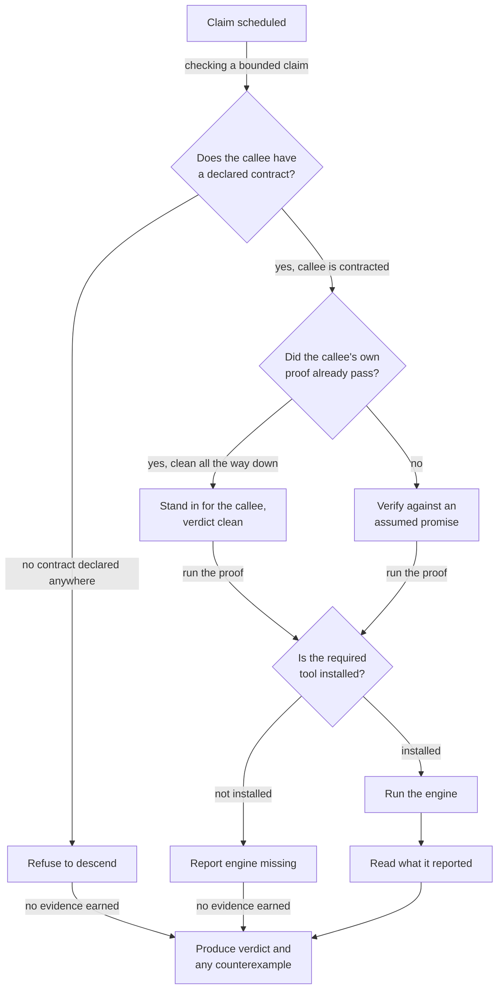
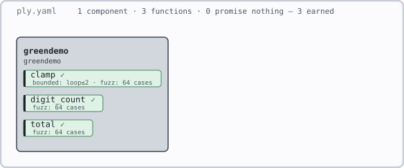

# Ply

Ply is a specification, verification, and visual-development layer for plain Rust.
It aims to bridge the gap between blind "trust me bro!" agent 'vibe' coding and reviewing every
generated line by hand.

A developer states what the program must do. An agent writes the implementation. Ply
routes those claims to existing checking tools, records the evidence they earn, and
reports concrete counterexamples when a claim fails. The developer reviews the intent,
the boundaries, and the uncovered risk instead of treating plausible code as proof.

> **Project status: active early-alpha development.** The CLI, schema, checking pipeline,
> result records, static SVG renderer, and interactive visual clients exist. Rust coverage remains narrow, and
> adversarial testing continues to find and close gaps between what a result says and what
> ran. Capabilities may change quickly; Ply is not ready to serve as production assurance.
> See [Current status](#current-status).

## Install

Two things go in: the command, and one dependency in the crate you want checked.

**The command.** Installs as a `cargo` subcommand:

```console
$ cargo install --git https://github.com/mattyv/ply ply-cli --locked
$ cargo ply --help
```

**The dependency.** The `#[ply::requires]` and `#[ply::ensures]` attributes come from a
crate you add to whatever you are checking. Under a plain `cargo build` they compile to
nothing, so this costs you no runtime behaviour:

```toml
[dependencies]
ply = { package = "ply-attrs", git = "https://github.com/mattyv/ply" }

# Ply's generated proof harnesses are `cfg(kani)`-gated. Without this line
# `cargo build` still works, but warns about an unknown cfg.
[lints.rust]
unexpected_cfgs = { level = "warn", check-cfg = ["cfg(kani)"] }
```

Then write what a function promises, and a `ply.yaml` beside your `Cargo.toml` saying
what evidence you want for it:

```rust
#[ply::ensures(|result| *result >= a)]
pub fn add(a: u32, b: u32) -> u32 {
    a.saturating_add(b)
}
```

```yaml
ply: 1

components:
  mycrate:
    anchor: mycrate          # your crate's library name
    fns:
      add:
        checks: [fuzz(64)]
```

```console
$ cargo ply check .          # grammar and anchors, no engines, fast
$ cargo ply verify .         # runs the checks and reports what they earned
workspace — fuzzed(64)
  mycrate — fuzzed(64)
    add — fuzzed(64)
```

**Engines.** `fuzz` and `test` need nothing beyond the above — proptest arrives with the
generated harness. Two checks need a tool on your `PATH`, and Ply says so rather than
skipping quietly if one is missing:

```console
$ cargo install --locked kani-verifier && cargo kani setup   # for bounded(k)
$ cargo install --locked cargo-mutants                       # for mutate
```

**What Ply leaves behind.** Generated harnesses live under `target/ply/`, which is
already ignored by every Rust `.gitignore`. Nothing else in your project is modified: on
a crate that declares its own workspace Ply borrows your `Cargo.toml` for the length of
the run and writes it back byte-for-byte when the run ends.

## The development loop

Ply is designed for a human-directed agent workflow:

1. A developer records components, architecture rules, contracts, and required checks.
2. Ply renders that intent before implementation begins.
3. An agent writes or changes ordinary Rust code.
4. Ply compares the implementation with the declared structure and runs the requested
   checks.
5. A failed executable claim returns a concrete input for the agent to repair.
6. The developer reviews the remaining assumptions, unsupported areas, and high-risk
   code.

This is review compression, not review elimination. Experienced developers still decide
what matters and inspect code where mechanical evidence stops.

**What step 2 can and cannot do before the code exists.** The drawing is available
immediately: `cargo ply render <dir> -o system.svg` reads `ply.yaml` alone, with no crate
behind it. Add `--json` when a visual client needs the same navigable component and
function hierarchy before code exists. `cargo ply check` is only half available: it validates the document's grammar with nothing else
present, but its architecture half reads your real crate dependency graph from `cargo
metadata`, so before there is a Cargo project to read there is nothing for it to check
against, and it says so rather than reporting a clean run. Anchors behave the same way:
point it at a crate whose promised functions are not written yet and it names each one.

### What step 4 actually decides

Ply keeps a diagram of its own architecture under [`.archi/`](.archi/), and this is one of
them — the path `cargo ply verify` walks for a single function that declares a `bounded`
check. It is the tool's most consequential piece of reasoning, because every branch here is
a decision about whether evidence may be claimed:



**Callees are checked before their callers**, always, and ties between unrelated functions
are broken by name so the same code always produces the same order. A function caught in a
dependency cycle never gets a clean turn, and falls through to the assumed-promise branch
below.

**Three decisions, and each one is a refusal to overclaim:**

*Does the callee have a promise at all?* If not, Ply will not read through it to find out
what it does, and will not pretend the check ran. Nothing is earned, and the warning names
the exact callee and where it is called from, so it is something a person can go and fix.
It offers two ways out: write a promise for the callee, or switch to a `fuzz` check, which
crosses the same boundary by simply running the real code. This branch was added after a
two-year-old unannotated function used to just time out with no explanation.

*Did that callee's own proof already pass, cleanly?* If yes, Ply swaps the callee's body
for a stand-in built from its promise, and nothing is assumed — but the result is only as
deep as the shallower of the two: a function declaring depth 5 that stands on a callee
proved to depth 2 gets a depth-2 result, never the deeper number. If no — the callee was
only fuzzed, or lives in another crate, or sits in a cycle — the stand-in is built from a
promise nobody has checked yet, and the verdict is marked as resting on it, with that
assumption tracked as debt until something runs the real callee against the same promise.

*Is the tool even installed?* A missing engine is reported by name with what to install.
Never a silent skip, and never reported as though the check quietly passed.

Reading the engine's answer is its own step for a reason: terminal colour codes are
stripped first, because a coloured `error:` line once slipped past every text match Ply had
and got reported as an unattributable failure instead of the plain compiler error it was. A
broken promise, a timeout, a crash and a refusal to run are four different facts and must
never arrive as the same one.

Two things this leaves out on purpose. A `fuzz` or `test` check skips the first decision
entirely — it runs the callee's real code, contract or not, so it never needs a stand-in.
And whether a stored result can be reused instead of running any of this again is a
separate diagram, [`verdict-lifecycle`](.archi/ply.json), rendered alongside this one.

### What you get when a check fails (step 5)

**Ply does not write your tests.** It writes exactly one, only when a promise actually
breaks, and it puts the input that broke it inside. A clean run leaves your source tree
untouched.

Two different things get generated and only one of them is yours to keep:

| | Where it lives | When | Yours? |
|---|---|---|---|
| The harness that runs the checks | `target/ply/fuzz/…` | every run | No — scratch, rewritten each time, never committed |
| **The failing test** | `src/ply_generated_cex.rs` | only when a promise breaks | Yes — an ordinary file in your crate |

The second one is the point of this section. A broken promise comes back as three things,
and every one of them is a file you can open. The example below is real output from
[`tests/fixtures/clamp`](tests/fixtures/clamp), a function whose promise is wrong for
every input above 100:

```rust
#[ply::ensures(|result| *result == x)]
pub fn clamp(x: u32) -> u32 {
    x.min(100)
}
```

**1. The failing input, in the run's own output.** `cargo ply verify` names the function,
quotes the promise it broke, and gives the input that breaks it:

```
[K0502] clamp::clamp — `clamp` breaks its own postcondition `|result|*result == x` for at least one input
    failing input: x = 4294967295
    Ply wrote a test that reproduces this to src/ply_generated_cex.rs -- run `cargo test` from this crate's root directory and it fails the same way this run just did.
```

**2. A plain `#[test]` in your own crate**, at `src/ply_generated_cex.rs`. It calls the
real function with that input and asserts the promise itself, so it fails under bare
`cargo test` on a machine with no Ply and no proof engine installed at all — which is
what makes it something you, or an agent, can iterate against. Fix it and it stays as a
regression test (panic messages abridged here; the file carries them in full):

```rust
#[test]
fn ply_cex_clamp_01() {
    let x: u32 = 4294967295u32;

    let result = &clamp(x);

    // Contract under test: #[ply::ensures(|result|*result == x)]
    // Arithmetic is evaluated in i128 so the test can report the broken
    // promise instead of overflowing while checking it.
    let __ply_ok = std::panic::catch_unwind(std::panic::AssertUnwindSafe(|| ((* result as i128)) == ((x as i128))));
    match __ply_ok {
        Ok(true) => {}
        Ok(false) => panic!("Broken promise in `clamp`: ... the left side of the contract evaluated to \
         {}, and the right side evaluated to {} ... fix the body or fix the `#[ply::ensures]` \
         line, and this test will pass. (K0502)", (* result as i128), (x as i128)),
        Err(_) => panic!("the contract's own check crashed at this input ... (K0502)"),
    }
}
```

```
test ply_generated_cex::ply_cex_clamp_01 ... FAILED
Broken promise in `clamp`: ... For this input, the left side of the contract evaluated to 100,
and the right side evaluated to 4294967295, which does not satisfy the contract's comparison.
```

Fix the body or fix the promise and the same test goes green, and it stays in the crate
as a regression test. The engine's own replay facility cannot do this: it re-runs the
function body and never re-evaluates the promise, so a broken postcondition replays
green there. That is why Ply renders its own test, and why the assertion is widened to
`i128` — a test that overflowed while checking the promise would be failing for the wrong
reason.

**3. The raw witness, kept.** The exact bytes the engine found are stored under
`target/ply/witness/<fn>.json` (here `[[255,255,255,255]]`), so a later run that no
longer fails can still re-render the test from the input that once did.

One honest limit. When the failure depends on a stand-in callee's invented return value
rather than on the function's own body, no plain-Rust test can reproduce it faithfully —
the rendered test would call the real callee, which never returns that value. Ply reports
that case by name (`W0541`) with the value and a proposed tightening of the promise,
instead of writing a test that passes for the wrong reason.

## A declarative grammar, and the line where it stops

Ply gives you a **declarative grammar** for describing a system: components and how they
nest, which may depend on which, what data flows between them, what capabilities each is
allowed, which types it alone may change, what each function promises, and what evidence
must be produced to earn that promise.

It is a grammar rather than a config format, and the difference is that you can **write a
system in it before the code exists**. Every scenario in [`vetting/`](vetting/) was designed
that way — the structure argued out in the grammar first, and the implementation written
against it afterwards.

Every construct in it is designed to be drawn. That is enforced rather than aspirational:
**a proposed feature with no clear visual form does not enter the grammar.** Each construct
has exactly one visual meaning, and the mapping runs both ways — the picture shows nothing
that was not declared, and everything declared can be shown. So the grammar cannot grow a
corner that is expressible but invisible.

And it is not a verification language. There is nothing to learn beyond the grammar itself,
and no part of your program gets rewritten in it.

That matters because of where it stops. Every function has a line across it — the project
calls it the **watermark**, because it marks the level declaration reaches:

- **Above the line** — the signature and its contract. This is yours. You declare what the
  function takes, what it returns, and what must be true of the result. It is data, it is
  reviewable, and it is what the picture draws.
- **Below the line** — the body. The loops, the arithmetic, the data structures. **Ply
  verifies below the line; it never specifies there.** The implementation is ordinary Rust
  and stays ordinary Rust, whether a person or an agent wrote it.

```rust
#[ply::requires(amount <= 1_000)]                  // ─┐  declared: yours, and drawable
#[ply::ensures(|result| *result >= amount)]        //  │
pub fn total(amount: u32, tier: u8) -> u32 {       // ─┘  the line
    amount + legacy_rate(tier)                     //      verified, never dictated
}
```

The line can move **down** — a future grammar may let you declare more than a signature and
a contract, if it can be drawn and checked. It can never move into the algorithm itself.
Specifying the body would mean building a verification language, which is the path this
project exists to avoid: those languages ask you to rewrite your program in their terms,
and most teams stop.

So the deal is narrow on purpose. **You say what must be true. Ply reports what was
actually checked, and where checking stopped.** Anything it could not reach is named rather
than assumed, which is why a green result is worth something.

The watermark is also why the picture above is worth drawing: it shows the level intent
reaches, per function, across a whole codebase at once — where promises are made, and where
code simply begins.

## Visual development

The rendered specification is part of the development surface, not a diagram produced
after the work is done. It lets a developer answer four questions at a glance:

- What did we intend to build?
- What evidence did each claim earn?
- Where is evidence missing, narrowed, or stale?
- Which exact source range should I inspect next?

The visual model has three layers:

1. **Intent** comes from `ply.yaml` and function contracts.
2. **Evidence** comes from test, fuzz, bounded-checking, mutation, and later proof
   results.
3. **Diagnostics** identify violations, unsupported areas, timeouts, assumptions, and
   exact source locations.

One view can then show dependencies, forbidden edges, violated contracts, unsupported
functions, stale results, assumptions, and evidence owed. Developers can zoom from a
workspace to a component or function, inspect the completed run, then open the recorded
source range.

Every visual mark must have one stable meaning. Colour alone must never carry that
meaning, and an unknown or unsupported fact must never look verified. A diagram that
hides uncertainty would recreate the problem Ply exists to solve.

### What it renders today

`cargo ply render <dir> -o system.svg` draws the spec you wrote before any code is
checked. The picture shows your intent, not a finished run. The command also accepts a
direct `ply.yaml` path; omit `-o` to print SVG to standard output. Add `--json` to emit
the declaration-only visual envelope used for semantic navigation; every item is
explicitly `unclaimed` because no verification has run.

That envelope carries the drawing more than once. Alongside the full picture it holds a
shorter one for each level the document can be folded to, laid out properly at that
level. A viewer that lets a reader pull back for less detail shows one of those instead of
hiding parts of the full drawing, which would leave every box at the size its hidden
contents needed.

This specification, from `vetting/004-legacy-extension/` — a new feature written beside a
ledger module that carries no promises of its own:

```yaml
ply: 1
components:
  ledger:                       # old code: no claims, nothing checked
    anchor: ledger
  withdrawal:                   # the new feature
    anchor: withdrawal
    pure: true
    fns:
      fee_cents:          { checks: [bounded(2)] }
      total_debit_cents:  { checks: [bounded(2)] }
      tier_fee_cents:     { checks: [bounded(2)] }
      approve_withdrawal:
        checks: [fuzz(256), test]
        examples:
          - "approve_withdrawal(1000, 5000, 3) == true"
          - "approve_withdrawal(5000, 5000, 0) == false"
      withdraw:           { checks: [bounded(2)] }
edges:
  - withdrawal -> ledger        # the one crossing that is allowed
```

renders as:

<p align="center">
  
</p>

The reading is meant to be immediate. A **solid** box is code that makes claims; the
**hatched** box is code that does not, so nothing about it has been checked. The hatching
is deliberate: absence drawn as blank space reads as background, and the one thing that
should worry you would be the quietest thing on the page. Each function carries the checks
it declares — `B2` for bounded to depth 2, `F256` for 256 sampled cases, `T` for worked
examples, `e×2` for how many; zoom into a component with `--focus` and those read out in
words, alongside what each function needs and gives. The arrow is the one dependency the
spec permits; anything else between these two would be a violation.

The line across the top says what the whole document declares and how much of it promises
nothing. It counts promises only, never results — the render never sees what a
verification found, and a picture full of promises should not look like a picture full of
results.

Most of what a diagram says is only reachable by hovering: on the trading-system example,
474 characters are drawn on the canvas and 9,923 sit in hover text — 95% of the render,
and all of the reasoning. `cargo ply render <dir> --text` writes the whole thing out as
prose instead, for reading in a terminal, piping into another tool, or handing to a model,
none of which can hover. Nothing in it is written by hand, and it is not a summary: every
check, contract clause, capability, profile rule, inherited default, trusted claim, edge,
forbidden rule and open question in the document appears in it, and a test walks the
document to prove it. One is committed beside each scenario in `vetting/`, kept in step
with the renderer by a test, so a change to the wording shows up in review as a diff
rather than passing unseen.

Nothing on this diagram is green, and that is the rule rather than an accident of this
example: green means evidence a run has actually earned, so before `cargo ply verify` has
run there is none to show. Grey depth is how strongly something promises to be checked.

That distinction is the point. The picture shows where the checked code ends and the
unchecked code begins, so an unverified boundary is visible rather than implied.

### The same idea, after a run

Every other drawing in this repository is a *before* picture. This one is not.
[`demos/verified-green/`](demos/verified-green/) is three small functions taken all the way
through `cargo ply verify --publish-view`, and the drawing it produced:

<p align="center">
  
</p>

The header now ends **3 earned**, and each chip is green with a tick. Green is never drawn
from the declaration — it appears only where a run actually earned it. `clamp` carries a
real proof from Kani, checked over every value rather than sampled; the other two were run
against 64 generated inputs each. `digit_count` takes a `&str`, which Ply refused outright
until 2026-09-01.

The run also says two honest things about itself, both visible on hover and neither a
defect:

- **`clamp` threw most of its inputs away.** Its precondition requires `lo <= hi`, and 69
  of 133 draws did not satisfy it. Ply kept drawing until 64 were accepted, so the count is
  honest — but every accepted case comes from the corner of the input space the
  precondition allows, which is weaker evidence than "64 cases" sounds.
- **`digit_count` was never given control characters.** Ply excludes raw bytes like a null
  or an escape code by default, on the grounds that they are likelier to trip something
  unrelated than to find a real bug. Accented and CJK text *is* generated. If the function
  needs to handle control characters, this run says nothing about it.

Both are printed by the run itself rather than written by hand here. A tool that reported
"3 earned" and stopped would be hiding the more useful half.

Four more rendered scenarios live in [`vetting/`](vetting/), each a design written in the
grammar before the tool could check it.

Ply is specified the same way, in two documents of its own: the [`ply.yaml`](ply.yaml) at
the root of this repository says which crates exist and who may depend on whom, and
[`crates/ply-core/ply.yaml`](crates/ply-core/ply.yaml) says what the library promises
about six of its own functions. Both are checked by `cargo ply check` like anyone else's.
[**ARCHITECTURE.md**](ARCHITECTURE.md) is both of them rendered and explained — including
the rule this codebase was found to be breaking when the checker was pointed at it, and
what declaring the exception would have cost.

### Interactive evidence views

`cargo ply verify <dir> --publish-view` publishes an immutable visual envelope under
`target/ply`. The separate [Ply Visual](https://github.com/mattyv/ply-vis) project renders
that envelope in a shared browser viewer, VS Code, and JetBrains IDEs. These clients show
the exact outcome Ply recorded; they never recalculate verdicts.

The interactive clients remain extremely beta. Visual spec editing is still future work.
Ply Visual also omits code-change highlighting: version-control tools already show diffs,
while Ply shows declared structure and verification evidence.

## A portable core with optional extensions

Ply's source of truth should remain independent of any editor. The portable core owns:

- the `ply.yaml` schema and contract model;
- code and architecture extraction;
- checking-engine orchestration;
- result fingerprints, verdicts, diagnostics, and counterexamples; and
- a machine-readable result envelope that visual clients can render.

A shared browser viewer now powers thin VS Code and JetBrains extensions. They discover
completed artifacts, render them, preserve view state, and navigate from evidence to exact
source ranges. They do not run Ply, parse `ply.yaml` or `ply.lock`, or interpret verdicts.
The LLM-facing workflow runs Ply and publishes a completed view only when requested.

The same core should support other clients: a browser application, another editor or IDE,
CI reports, static HTML or SVG, and the terminal. No client should keep private evidence
or invent its own interpretation of a verdict. A result should mean the same thing in VS
Code, on a build server, and in a generated report.

Visual editing may eventually write reviewed changes back to the specification: draw an
allowed dependency, add an invariant, or declare an external boundary. It should never
silently rewrite implementation code. The approved spec change comes first; an agent can
implement it afterward.

## What Ply does today

Ply is a Cargo subcommand backed by a YAML specification and Rust contract attributes.
Six commands exist:

| Command | Purpose |
| --- | --- |
| `cargo ply render <dir>` | Draw `ply.yaml` as SVG before code or a Cargo project exists. `--text` writes prose; `--json` writes a navigable declaration-only visual. |
| `cargo ply check <dir>` | Validate `ply.yaml`, resolve claims, and run the available architecture checks without starting verification engines. |
| `cargo ply verify <dir>` | Run declared checks and report the evidence each function earned. |
| `cargo ply audit <dir>` | List the trust surface: assumptions and declarations Ply does not verify. |
| `cargo ply worklist <dir>` | List unresolved decisions and evidence still owed. |
| `cargo ply clean-views <dir>` | Remove older published visual runs while preserving the current run. |

The render, inspection, and verification commands support `--json`. Published visual envelopes
are the stable integration surface for editor extensions and other visual clients.

Ply delegates checking rather than building its own solver. Depending on the declared
check, it uses Cargo's test runner, property testing, Kani, or `cargo-mutants`. Passing
results distinguish tested, fuzzed, and bounded evidence; missing engines, unsupported
inputs, timeouts, and inconclusive runs remain visible.

See [`docs/SCHEMA.md`](docs/SCHEMA.md) for the user-facing reference (it trails the
code by design — where the two disagree, `cargo ply check`'s own closing paragraph is
the authority on what is checked) and
[`The-Ply-Spec.md`](The-Ply-Spec.md) for the implementation specification.

## Design principles

- **Fail closed.** Ply may decline a check, but it must not claim evidence it did not
  earn.
- **Keep intent human-owned.** Agents may propose contracts and architecture changes;
  developers approve them.
- **Make evidence inspectable.** A verdict names the engine, scope, assumptions, and
  counterexample or explains why none exists.
- **Render the same truth everywhere.** The terminal, static renderer, CI, and editor
  extensions consume the same model and result envelope.
- **Keep ordinary Rust ordinary.** Ply adds specifications and generated checking
  harnesses without replacing Rust or compiling a new application artifact.
- **Use existing engines.** Ply supplies orchestration, evidence accounting, and the
  development interface; other projects supply solvers and test engines.

## Current status

Ply is being developed through fixtures, fault injection, adversarial reviews, and trials
against ordinary Rust crates. That work has found meaningful defects, including checks
that ran no cases, incomplete receiver histories, unsupported common Rust shapes, and
shared generated harnesses that can make unrelated checks fail together.

The immediate goal is a narrow, explicit fragment that fails closed. Broader Rust support
comes after a developer can trust every green result inside that fragment. Reviews such as
[`docs/review-structs-enums.md`](docs/review-structs-enums.md) capture the build they
examined; active development may already have fixed findings they describe. The working
backlog and historical findings are in [`TODO.md`](TODO.md).

Ply's long-term promise is simple:

> See what you intended, what the agent built, and what has actually been checked.
