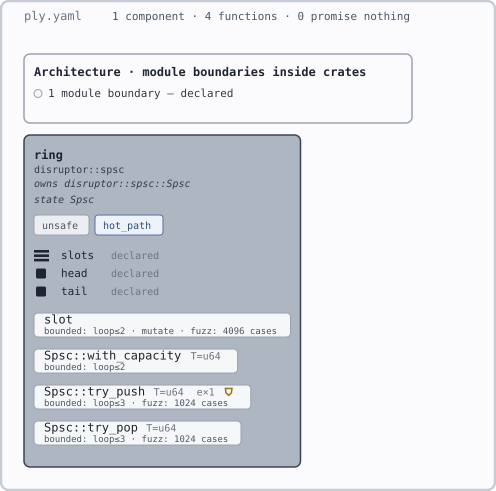

# Vetting 001 — SPSC disruptor queue

Scenario: express a single-producer/single-consumer ring buffer (LMAX-disruptor style)
in Ply, before the tool exists, and record where the grammar holds and where it breaks.
Run 2026-08-23 against SPEC.md as of that date.

## The design under test

```rust
pub struct Spsc<T> {
    buf: Box<[UnsafeCell<MaybeUninit<T>>]>,
    mask: usize,                 // capacity - 1, capacity is a power of two
    head: AtomicUsize,           // consumer cursor
    tail: AtomicUsize,           // producer cursor
}

impl<T> Spsc<T> {
    #[ply::requires(cap > 0 && cap <= (1 << 20) && (cap & (cap - 1)) == 0)]
    #[ply::ensures(|result| result.capacity() == cap)]
    pub fn with_capacity(cap: usize) -> Self { ... }

    #[ply::pure]
    pub fn capacity(&self) -> usize { self.mask + 1 }

    #[ply::pure]
    pub fn len(&self) -> usize { ... }   // tail - head, wrapping

    #[ply::ensures(|r| r.is_err() == (self.len() == self.capacity()))]
    pub fn try_push(&self, v: T) -> Result<(), T> { ... }

    #[ply::ensures(|r| r.is_none() == (self.len() == 0))]
    pub fn try_pop(&self) -> Option<T> { ... }
}

#[ply::pure]
#[ply::requires((mask + 1) & mask == 0)]
#[ply::ensures(|r| r <= mask)]
fn slot(seq: usize, mask: usize) -> usize { seq & mask }
```

```yaml
ply: 1
components:
  ring:
    anchor: disruptor::spsc
    uses: [unsafe]
    owns: [disruptor::spsc::Spsc]
    profile: hot_path
    fns:
      slot:
        checks: [bounded(2), mutate, fuzz(4096)]
      Spsc::with_capacity:
        checks: [bounded(2)]
        check_with: { T: u64 }
      Spsc::try_push:
        checks: [bounded(3), fuzz(1024)]
        check_with: { T: u64 }
        trusted:
          - { claim: "SPSC cross-thread safety (happens-before between cursors)",
              evidence: "loom test tests/loom_spsc.rs" }
        examples:
          - "{ let q = Spsc::with_capacity(2); q.try_push(7).is_ok() } == true"
      Spsc::try_pop:
        checks: [bounded(3), fuzz(1024)]
        check_with: { T: u64 }
profiles:
  hot_path: [no_panics, exhaustive_match]
```

## What held

- The sequential skeleton — where most ring-buffer bugs live — expressed cleanly:
  power-of-two capacity as plain arithmetic, index masking proved for all inputs at
  `bounded`, full/empty logic tied to `result` through pure helpers.
- The pure-helper trust rules (§5.4a) fired as designed: `len`/`capacity` get the A0408
  capability check, appear in `audit`, and an unchecked helper makes dependents
  `conditional`.
- `uses: [unsafe]`, `owns`, and the `no_panics` profile were natural fits.

## Findings → spec changes

1. **No way to record externally-verified properties.** The queue's load-bearing claim
   (cross-thread safety) is out of Ply's scope, and the tree rendered green anyway.
   → Added `trusted` claims (§5.4d): attested-with-evidence entries, audit-listed,
   hollow-shield badge, never machine-checked, never added by an agent.
2. **Generics made the whole API unsupported.** `Spsc<T>` methods had no checkable
   instantiation. → Added `check_with: { T: u64 }` (§5.4b): one concrete instantiation
   per fn, named in the verdict (`bounded(3) as T=u64`).
3. **Examples were accidentally subset-restricted.** The block-expression example was
   illegal under a literal reading of §5.4a "accepted everywhere". → §5.4a now applies
   to contracts only; examples are arbitrary Rust `==` expressions.

## Rendered



Produced by `ply-render tools/render/tests/fixtures/spsc.ply.yaml`. That fixture is this
document's YAML block verbatim — the renderer runs on the scenario itself, not a
simplification of it.

### Findings from the render pass (2026-08-23)

1. **The renderer emitted a solid black square.** Structure and classes were right; there
   was no stylesheet at all, and SVG's initial paint is `fill: black`, so every box drew
   over the one behind it. All 30 structural tests passed throughout — none of them looked
   at whether the output was visible. → Added the `STYLE` block and
   `every_painted_element_resolves_a_style_rule`, which walks the rendered XML and fails
   if any painted element resolves no rule through its own class or an ancestor's.
2. **`owns` was a live bijection violation.** Parsed, semantically load-bearing, drawn
   nowhere — the §7.1 gate should have refused it. → Now a header line (`owns T, U`), and
   a row in the §7.1 table.
3. **Five more constructs have no visual form**: `strict`, `mode: synth`, contract clauses,
   `examples`, `profiles` expansion. Recorded as gate debt in §7.1 rather than quietly
   dropped. `mode: synth` is the notable one — §7.2 makes it the mechanism that moves the
   watermark, and it is invisible.
4. Character-width estimate was under the real monospace advance, so long fn names
   collided with their checks glyphs. Widened.

## Confirmed walls (deliberate, unchanged)

- FIFO ordering ("pop returns values in push order") needs two-state contracts or a
  model-based spec — the parked middle stratum (§7.2 honesty note). First candidate
  when the watermark moves.
- Cross-thread correctness itself stays out of scope (loom et al.); Ply's contribution
  is making the boundary visible (`trusted`), not crossing it.
