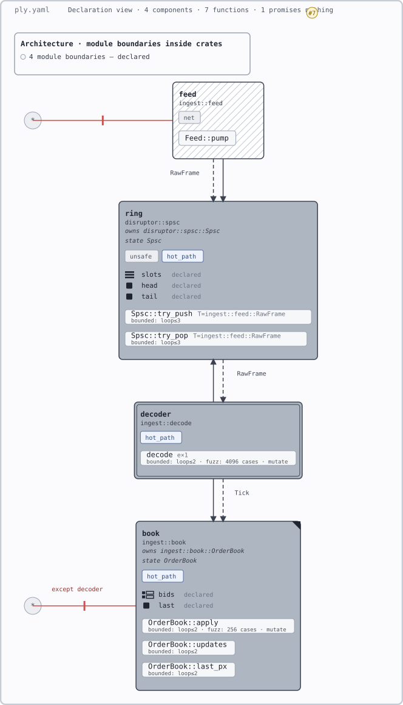

# Vetting 002 — market-data ingest pipeline

Scenario: a consumer of 001's SPSC ring — socket feed pushes raw frames in, a pure
decoder pops and decodes them, an order book applies the ticks. Written to exercise
everything 001's single component structurally couldn't: the architecture tier
(edges, flows, deny, capability containment), modular composition (D5), aggregation
across a real tree, and the first use of `old()` after §5.4a admitted it.
Run 2026-08-23 against The-Ply-Spec.md as of that date, with `ply-check` and `ply-render`
live — the first scenario authored with the tools running.

## The design under test

```rust
// ingest::feed — the only component allowed `net`
pub struct RawFrame { pub len: u8, pub bytes: [u8; 64] }   // public, invariant-free

impl Feed {
    pub fn pump(&mut self, ring: &Spsc<RawFrame>) { ... }   // no contract — unclaimed, honestly
}

// ingest::decode — pure
pub struct Tick { pub sym: u32, pub px: i64, pub qty: u32 }

#[ply::requires(frame.len as usize <= 64)]
#[ply::ensures(|r| matches!(r, Ok(t) if t.px > 0 && t.qty > 0) || r.is_err())]
pub fn decode(frame: &RawFrame) -> Result<Tick, DecodeErr> { ... }

// ingest::book — strict; sole mutator of OrderBook
#[ply::requires(tick.px > 0 && tick.qty > 0)]
#[ply::ensures(|_| self.updates() == old(self.updates()) + 1)]
#[ply::ensures(|_| self.last_px() == tick.px)]
pub fn apply(&mut self, tick: Tick) { ... }

#[ply::pure] pub fn updates(&self) -> u64 { ... }
#[ply::pure] pub fn last_px(&self) -> i64 { ... }
```

Canonical YAML: [002-ingest-pipeline.ply.yaml](002-ingest-pipeline.ply.yaml).
`ply-check` passes it clean (exit 0).

## What held

- The whole architecture tier expressed naturally on first contact: call edges,
  typed flows (`feed ~> ring : RawFrame`), `deny: * -> book except decoder`,
  capability containment (`net` stops at `feed`), `pure` on the decoder, `strict`
  on the book, `unresolved` registry entry for the backpressure decision.
- `old()` did exactly what it was admitted for: `apply`'s update-count and last-price
  postconditions are single-write-visible, correct, and checkable — none of 001's
  post-state paradoxes.
- The stateful-receiver wall from 001 turns out to be **type-shaped, not grammar-shaped**:
  `OrderBook` with public invariant-free fields is Arbitrary-derivable, so
  `apply(&mut self, ...)` genuinely fuzzes — unlike `Spsc`, whose privacy and
  invariants put it behind the wall. Design guidance, not a spec change: state you
  want checked should be constructible state.
- `ply-check` caught nothing here — but it ran, which is the point; the scenario was
  validated mechanically while being written, not eyeballed.

## Findings → spec changes

1. **The flow-edge syntax collides with YAML itself.** `- feed ~> ring : RawFrame`
   unquoted is a YAML *map* (`{"feed ~> ring": "RawFrame"}`), not a string — the
   `: ` in the micro-syntax is also YAML's key separator. The error surfaced as
   `edges[3]: invalid type: map, expected a string`, which names the symptom, not the
   cause. Call edges (no colon) don't need quotes, so the two edge kinds silently
   require different lexical treatment. → Candidate: §5.1a lexical note requiring
   quoting of flow edges (or all edges), and a targeted hint in the parse error.
2. **The grammar has no way to reuse a component across documents.** `ring` is
   redeclared verbatim from 001; in a merged workspace the duplicate anchor is E0202.
   Worse, the instantiation diverges: 001 checked `T: u64`, this pipeline needs
   `T: ingest::feed::RawFrame`, and one-`check_with`-per-fn (§5.4b) means the claims
   *replace* each other rather than accumulate. D5's assumption chain should at
   minimum name an instantiation mismatch when a caller's `T` differs from the one
   the callee's evidence was earned at. → Open spec question; recorded, not resolved.
3. **Fixed-size arrays are missing from the supported-signature set.** §5.4b lists
   integers, structs/enums, `Option`/`Result`/`Vec`, references — but not `[T; N]`,
   so `RawFrame.bytes: [u8; 64]` makes the type unsupported under a literal reading.
   Both Kani and proptest handle arrays natively; this looks like an oversight, not a
   wall. → Candidate: add `[T; N]` of supported `T` to §5.4b.
4. **`matches!` guards bind identifiers the subset doesn't account for.** The decode
   ensures uses `matches!(r, Ok(t) if t.px > 0 ...)`; §5.4a says identifiers must
   resolve to parameters or `result`, and `t` is neither — it's a binding introduced
   by the pattern. A literal E0501 implementation would reject the only idiomatic way
   to state a property of the `Ok` value (`.unwrap()` is outside the subset too).
   → Candidate: §5.4a clarification that pattern bindings introduced inside
   `matches!` are in scope for its guard.

## Rendered

[](002-ingest-pipeline.svg)

Produced by `ply-render vetting/002-ingest-pipeline.ply.yaml`. Click through for
hover tooltips; embedded as an image the hover is dead.

### Findings from the render pass (2026-08-23)

1. **Call edges are drawn ~12 units long.** The declared `feed -> ring`,
   `decoder -> ring`, `decoder -> book` render as stubs shorter than an arrowhead,
   invisible next to the flow arrows; `decoder -> ring` (pointing *up* the stack) is
   indistinguishable from nothing. The tooltip walk still passes — the item resolves
   a title — so the invariant tests can't see this class of defect: present,
   explained, and illegible.
2. **Flow labels sit on the arrowheads.** `RawFrame`/`Tick` render centered on the
   marker, cutting both label and arrow.
3. **Deny rules are clipped off the canvas.** Both wildcard deny nodes (`* -> feed`,
   `* -> book except decoder`) draw half outside the left edge, and the
   `except decoder` label is truncated. Canvas width ignores deny geometry.
4. **`strict` is invisible — gate debt now live.** `book` is strict and the diagram
   shows nothing; same for `decode`'s `examples`. These were recorded as §7.1 gate
   debt in 001's render pass; 002 is the first scenario where the missing forms hide
   real declared semantics.

## Confirmed walls (deliberate, unchanged)

- Nothing checks the flows: `~>` is declared, drawn, and untested (out of scope for
  v1 by D-decision). Ordering across the pipeline (frames decode in arrival order)
  is the same parked model-based-spec wall as 001's FIFO.
- `Feed::pump` is honestly unclaimed: socket I/O has no harnessable contract; its
  correctness story is the deny rules and capability wall around it, not a check.
