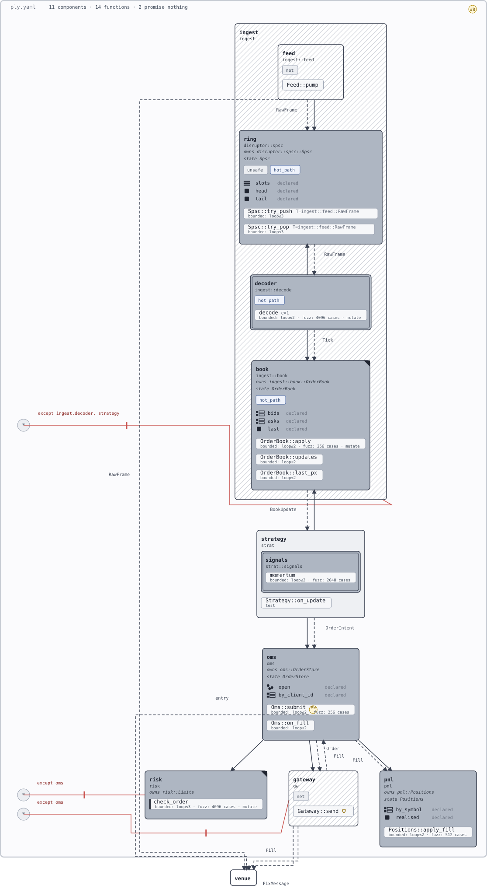

# Vetting 003 — trading system (one layer up)

Scenario: the whole of 002 becomes one nested component (`ingest`) inside a trading
system — strategy with a nested signals library, risk (strict), order management,
positions/PnL, and a venue gateway. Written to exercise what no scenario has touched:
**nesting** (`components:` inside a component, in the grammar and renderer since day
one, never used), **dotted references** (`strategy -> ingest.book`, §5.1a rule 6), a
tree deep and wide enough to stress aggregation, and the zoom model's first contact
with reality.

Canonical YAML: [003-trading-system.ply.yaml](003-trading-system.ply.yaml).

## The design under test

Seven top-level concerns; market data flows in the left column, orders flow down the
right, fills flow back:

```
ingest [ feed → ring → decoder → book ]      (all of vetting 002, one level down)
   book ~> strategy [ signals ] ~> oms ~> gateway ~> venue
                                   oms -> risk   (pre-trade check)
                                   oms ~> pnl    (fills)
```

- `risk.check_order` is the highest-value verification target in the system — a pure
  decision function (order + limits in, allow/deny out) carrying the heaviest checks
  (`bounded(3), fuzz(4096), mutate`).
- `gateway.send` is honestly unclaimed: venue I/O can't be harnessed; its evidence is
  a `trusted` claim naming the exchange certification run, plus the deny wall
  (`* -> gateway except oms`).
- Two open decisions ride along: `#8` venue failover (workspace-level) and `#9` order
  id policy after a reject (pinned to `Oms::submit`).

## What this probes (and 001/002 could not)

1. **Nesting.** `ingest` holds four child components; `strategy` holds `signals`.
   First recursive render, first nested aggregation.
2. **Dotted references.** Outer edges target `ingest.book`, `ingest.ring`; a deny
   rule's `except` list carries dotted entries (`except ingest.decoder, strategy`).
   Bare `signals` tests unique-leaf resolution from outside its parent.
3. **Aggregation at depth.** The kernel's container rule (fold children only) now has
   a two-level tree to be right about; `ingest`'s rolled-up verdict is the number a
   collapsed box should someday display.
4. **The zoom model.** §7 promises collapse/expand; §7.1 has a visual form for a
   collapsed box (weakest descendant's fill) but verdicts don't exist yet and the
   renderer has no collapse. Expected finding, recorded when the render pass runs.
5. **Component reuse pressure.** 002's pipeline is hand-copied here, dotted paths
   rewritten throughout — 002's finding 2 (no import mechanism) felt at full size.

## Planned probes for the tool runs

- Ambiguity (E0206): temporarily refer to bare `book` while both `ingest.book`
  exists — the validator should name the candidates and demand the dotted form.
- Scoping gap: all of `ingest`'s *internal* edges must be written at top level with
  full dotted paths (`ingest.feed -> ingest.ring`) because `edges:` only exists on
  the document — there is no component-scoped edge list. Candidate finding.

## Runs (2026-08-23, findings-layer toolchain)

`ply-check` passes the document clean (exit 0), so the findings layer draws nothing
red — correct on both counts.

### The ambiguity probe — and what it taught

The planned probe was wrong as written: with only one component named `book` in the
tree, a bare `book` reference from the top level is *legal* (unique-leaf rule) and
resolves to `ingest.book` — the validator rightly says nothing. Ambiguity needs two
leaves sharing a name. Giving `strategy` a nested `book` of its own and then writing
`strategy -> book`:

```
E0206: ambiguous component reference "book": matches ingest.book, strategy.book
       — use the dotted qualified form (§5.1a rule 6)
```

Exactly the specced behavior: both candidates named, the fix stated. Rule 6 held.

### Rendered

[](003-trading-system.svg)

Produced by `ply-render vetting/003-trading-system.ply.yaml`. First nested render
ever: `ingest` draws its four children with their internal edges inside the parent
box, `strategy` nests `signals`, dotted `except` lists render, and the whole system
reads top-to-bottom. The structure held.

### Findings from the render pass (2026-08-23)

1. **Intra-container edge labels collide with boxes.** Inside `ingest`, the
   `RawFrame`/`Tick` labels sit on the ring and decoder box borders. The label
   clearance logic reserves space against the *edge line*, not against neighboring
   boxes — at top level there is slack; inside a container there isn't.
2. **An edge to a nested target cuts through its parent's content.** The
   `strategy -> signals` call edge draws diagonally across the `signals` box
   itself. → Resolved at the root: the edge should never have existed.
   Containment implies permission — a component calls its own descendants the
   same way it calls between its own functions, no edge declared (§5.3, new
   `W0409` redundant-edge lint; validator implementation queued). The edge is
   deleted and the diagonal with it. Cross-container edges into another
   component's descendant (`strategy -> ingest.book`) remain legitimate and
   still need the routing polish.
3. **Same-rank deny rules overlap.** `* -> risk except oms` and
   `* -> gateway except oms` both anchor their `*` node at the same left-edge
   spot; the two red lines and both `except oms` labels draw on top of each other,
   one struck through. Deny geometry needs the same lane separation call/flow
   edges got in 002.
4. **The deny bar can strike its own `except` text** (`...decoder, strategy` on
   the book rule). Same clearance family as finding 1.

None of these are structural: every element is present, explained, and on-canvas —
the 002-era invariants all pass. The gap is *collision-freedom inside containers*,
a property no current invariant expresses. Next renderer pass should add one
(no drawn element intersects a box it isn't inside) and make it red first.

### Standing observations

- Container aggregation is now on the canvas: every box carries its **declared
  ceiling** (§7.1) — a pastel fill computed by the kernel's real `aggregate()`
  over the checks lists. `ingest` reads unclaimed-white because `Feed::pump`
  declares nothing and worst-of is merciless; `strategy` reads barely-tinted
  (`tested`); `risk` reads deepest. Earned verdicts, when `cargo ply` exists,
  take the full-saturation version of the same scale.
- Hand-copying 002 into `ingest` took a full rewrite of every internal edge to
  dotted form — 002 finding 2 (no reuse mechanism) at full size, as predicted.
- There is no component-scoped `edges:` list; all seventeen edges live at the
  document top level, twelve of them fully dotted. Verbose but unambiguous —
  candidate grammar question rather than defect.
